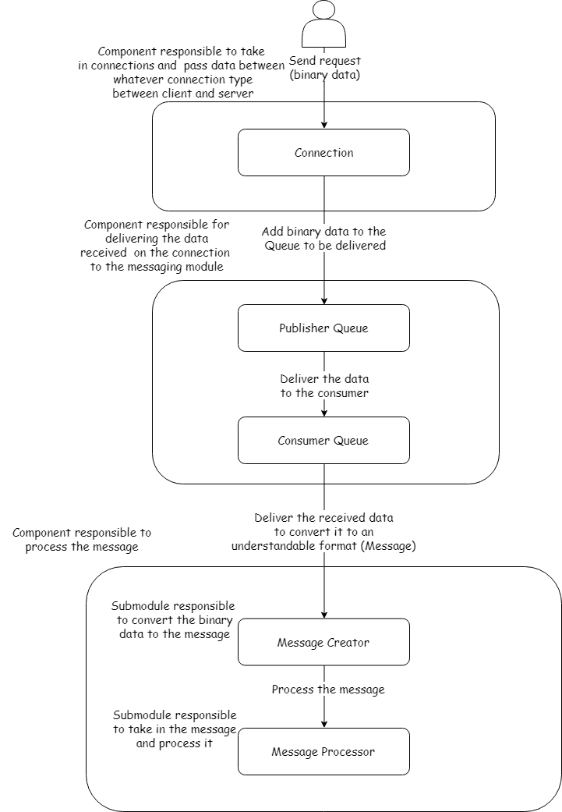
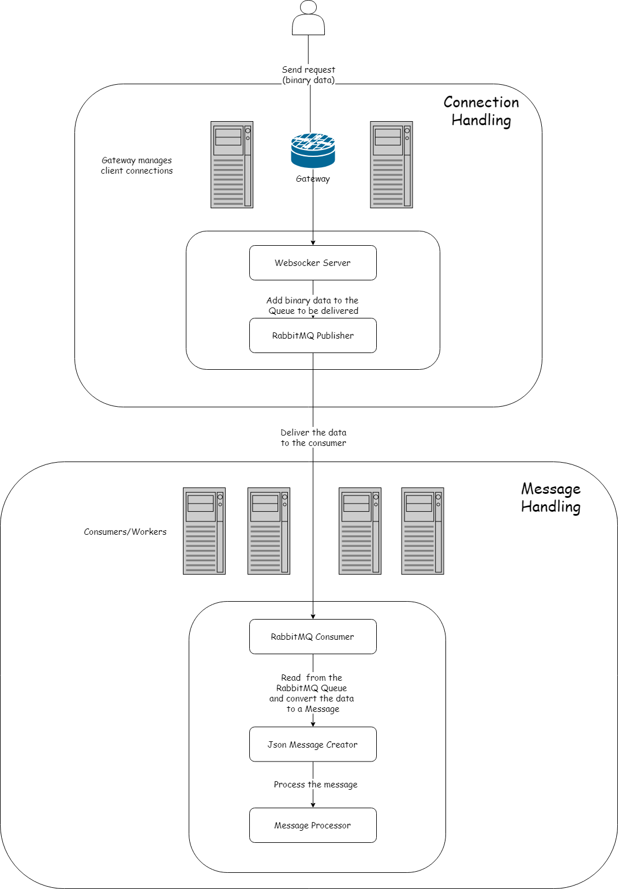

Mitto is a scalable Client/Server framework with a Request/Response model written in C#.

The aim is to provide a simple framework that is easy to start with and can be scaled up when needed and have each component as interchangable as possible so the user has the flexability to customerize each component for its project

Note that this was created as a proof of concept and learning exercise.

For a more mature option that's maintained a good alternative [RocketLib](http://rockframework.org/) is a good option.

Documentation
=============

Documentation can be found on readthedocs:

https://mitto.readthedocs.io/en/latest/

Below is a short introduction and small sample, more complete documentation and samples can be found [here](https://mitto.readthedocs.io/en/latest)

Introduction
============

Mitto was created to solve the problem of communication between a Client/Server and build on a few simple concepts:

- reusable: easy to set up and use in multiple projects & languages
- scalable: both the client as server should be able to scale horizontally
- moduler: have the ability switch out technologies, Websockets/Json messages, message queing

Mitto is usable on any scale from small projects that require only a few connections and messages to projects that can scale to thousands of clients.

Each component can also be switched out for other technologies and languages.

The component overview below shows each component that can be interchanged.

Connection:
- Websockets
- TcpConnection
- nix socket
- ...

Queing:
- RabbitMQ (AMQP)
- any AMQP or MQTT system
- PassThrough (let the process itself process the message)

Message Creator:
- Json to object
- XML to object
- byte message

Message Processor:
- Actions called by request object
- whatever the interpretation and processing of the binary data is

This is a high level overview of the server components.
Only the server side will be shown here as the client has the same architecture.

Sample server with Websockets, RabbitMQ and Json representation of requests for the server:

Sample
=======

See the Samples directory to see a client and server implementation as sample.

The code below can be found in those samples.

Client
------

Samples are included in the sample directory.

This is a simple client that sends a ping and expects a pong:

    Client:
    using Unity;
    using ClientManager;
    using System;

    namespace SampleClient {
        class Program {
            static Client _objClient;

            static void Main(string[] args) {
                IConnection.ConnectionFactory.UnityContainer.RegisterType<IConnection.IClient, Connection.Websocket.Client.WebsocketClient>();
                IQueue.QueueFactory.UnityContainer.RegisterType<IQueue.IQueue, Queue.PassThrough.PassThrough>();
                IMessaging.MessagingFactory.UnityContainer.RegisterType<IMessaging.IMessageCreator, Messaging.Json.MessageCreator>();
                IMessaging.MessagingFactory.UnityContainer.RegisterType<IMessaging.IMessageProvider, Messaging.App.Client.ClientMessageProvider>();

                Start();

                Console.ReadLine();
            }

            static void Start() {
                _objClient = new Client();
                _objClient.Connected += ObjClient_Connected;
                _objClient.ConnectAsync("localhost", 80, false);
            }

            static void ObjClient_Connected(Client pClient) {
                _objClient.Request<Messaging.Base.Response.Pong>(new Messaging.Base.Request.Ping(), (Messaging.Base.Response.Pong pResponse) => {
                    Console.WriteLine("Pong Received");
                });
            }
        }
    }

Setting up and using a Client requires a few small steps:
- select the component type that should be used for each component
- make a connection to the server
- make a ping request

Connection Type(s):
--------------------

This describes how the client and server connect to eachother.
Currently only Websockets  is included, to configure(set) it:

    ConnectionFactory.UnityContainer.RegisterType<IConnection.IClient, WebsocketClient>();

To connect to the server:

    Client _objClient;
     void Connect() {
        _objClient = new Client();
        _objClient.ConnectAsync("localhost", 80, false);
    }

Next step will be to configure the Queing and Messaging type that will be used so that actual work can be done

Queing
-------

Queing can be done in multiple ways:
- PassThrough
- RabbitMQ

For a client connection mostly PassThrough will be used.
This type lets the application itself process/handle the work.

Example:

    IQueue.QueueFactory.UnityContainer.RegisterType<IQueue.IQueue, Queue.PassThrough.PassThrough>();

Messaging:
----------

Messaging needs two things to be set
- set the class responsible to supply us the messages and actions that exist
- give meaning to the binary data (bytes -> json -> object)

So to configure the messaging:

    IMessaging.MessagingFactory.UnityContainer.RegisterType<IMessaging.IMessageCreator, Messaging.Json.MessageCreator>();
    IMessaging.MessagingFactory.UnityContainer.RegisterType<IMessaging.IMessageProvider, Messaging.App.Client.ClientMessageProvider>();

Now a request can be done:

    Client objClient;
    objClient = new Client();
    objClient.Connected += delegate {
        objClient.Request<Messaging.Base.Response.Pong>(new Messaging.Base.Request.Ping(), (Messaging.Base.Response.Pong pResponse) => {
            Console.WriteLine("Pong Received");
        });
    };
    objClient.ConnectAsync("localhost", 80, false);

In this example ping is being used, this is part of the base package and does not require any additional work.

See the [documentation](https://mitto.readthedocs.io/en/latest) how to learn how to add new messages and actions (handlers)

Server
------

The server includes the same steps as the client, a simple websocket server:

    using System;
    using System.Net;
    using System.Threading;
    using ServerManager;
    using Unity;

    namespace ConnectionServer {
        class Program {
            static ManualResetEvent _objClose = new ManualResetEvent(false);
            static Server _objServer;
            static void Main(string[] args) {
                IConnection.ConnectionFactory.UnityContainer.RegisterType<IConnection.IServer, Connection.Websocket.Server.WebsocketServer>();
                IQueue.QueueFactory.UnityContainer.RegisterType<IQueue.IQueue, Queue.PassThrough.PassThrough>();
                IMessaging.MessagingFactory.UnityContainer.RegisterType<IMessaging.IMessageCreator, Messaging.Json.MessageCreator>();
                IMessaging.MessagingFactory.UnityContainer.RegisterType<IMessaging.IMessageProvider, Messaging.App.Server.ServerMessageProvider>();

                _objServer = new Server();
                _objServer.Start(IPAddress.Any, 80);

                Console.CancelKeyPress += delegate (object sender, ConsoleCancelEventArgs e) {
                    _objClose.Set();
                };
                _objClose.WaitOne();
            }
        }
    }

The sample above starts up a websocket server and makes it so that any incomming data is handled as json and it is known what messages exist.

Setting up the server as a websocket server

    IConnection.ConnectionFactory.UnityContainer.RegisterType<IConnection.IServer, Connection.Websocket.Server.WebsocketServer>();

Next is the Queing system just as what we did for the client:

    IQueue.QueueFactory.UnityContainer.RegisterType<IQueue.IQueue, Queue.PassThrough.PassThrough>();

The messaging configuration for the server is the same as the client.

See the [documentation](https://mitto.readthedocs.io/en/latest) how to learn how to add new messages and actions (handlers)

    IMessaging.MessagingFactory.UnityContainer.RegisterType<IMessaging.IMessageCreator, Messaging.Json.MessageCreator>();
    IMessaging.MessagingFactory.UnityContainer.RegisterType<IMessaging.IMessageProvider, Messaging.App.Server.ServerMessageProvider>();

After the configuration the actual server can be started:

    var objServer = new Server();
    objServer.Start(IPAddress.Any, 80);

ToDo's
======

- Make the connection types plugins:
    ./Mitto.dll
    ./plugins/Mitto.WebsocketSharp.dll (implements IConnection)
    ./plugins/Mitto.Log4Net.dll (impements ILog)